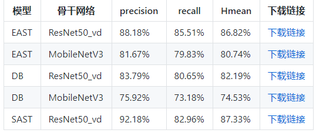

# 注意：

本项目使用paddelocr作为核心技术，其他版本可能需要自己修改代码

# 1.环境位置及部署说明
## 编译器：

PyCharm 安装教程（Windows: https://www.runoob.com/w3cnote/pycharm-windows-install.html

选择版本:PyCharm Community Edition 2020.3.5  

安装python:python 3.8

## vue插件:

pycharm配置vue教程(https://www.cnblogs.com/zezhou/p/13019386.html)

## 部署说明:

在Python环境和Vue插件配置好后，需要安装使用到的库。

### (1) 后端

安装所需要的python库: 在Terminal中输入依次输入下列命令行
```bash
pip install -r requirements.txt
```

启动用户登录

```bash
python run.py
```
启动flask项目识别图片

```bash
cd back-end
python app.py
``` 

### (2) 前端部署

先安装依赖：在Terminal中输入依次输入下列命令行

```bash
cd vue
npm install
```

然后运行前端：

```bash
npm run serve
```

然后在浏览器打开localhost即可得到演示demo效果


# 2.接口使用说明

## (1)back-end(后端服务器)

改文件存储图片识别的逻辑代码和前后端交互代码

### 其中，app.py为前后端交互代码
此处以身份证识别接口为例,通过Flask框架写相应函数：
```bash
@app.route('/upload', methods=['GET', 'POST'])
#上传文件接口
def upload_file():
    # file是目标文件
    file = request.files['file']
    print(datetime.datetime.now(), file.filename)
    if file and allowed_file(file.filename):
        src_path = os.path.join(app.config['UPLOAD_FOLDER'], file.filename)
        file.save(src_path)
        shutil.copy(src_path, './tmp/ct')
        image_path = os.path.join('./tmp/ct', file.filename)
        # 此处为调用身份证图片识别接口
        # pid 为图片名称信息
        # img_z 为识别后的图片
        # image_info 为图片识别信息
        # id_info 为身份证结构化信息
        pid, img_z, image_info, id_info = core.main.c_main(
            image_path, Detector, file.filename.rsplit('.', 1)[1])
        return jsonify({'status': 1,
                        'image_url': 'http://127.0.0.1:5003/tmp/ct/' + pid,
                        'draw_url': 'http://127.0.0.1:5003/tmp/draw/' + pid,
                        'image_info': image_info,
                        "id_info": id_info})

    return jsonify({'status': 0})
```
这样前端发出POST请求时，会对上传的图像进行处理。

### 图片预测接口

processor文件中AIDetector_pytorch.py为各类型图片预测的接口。此处以身份证识别接口为例

其中，cut_text_area.py(切割图片)\pre_processer.py(识别)\siftAlign.py(透视变换摆正图片)分别为身份证结构化识别的处理操作

AIDetector_pytorch.py中，如下代码完成对身份证结构化识别的接口调用，并返回处理后的信息。
```bash
class Detector(object):

    def __init__(self):
        self.init_model()

    def init_model(img):

        # ****************采用paddlehub预测文字区域************/
        model = hub.Module(name="chinese_ocr_db_crnn_mobile")
        # 服务端可以加载大模型，效果更好
        # ocr = hub.Module(name="chinese_ocr_db_crnn_server")
        # 读取照片路径
        np_images = [cv2.imread(img)]

        results = model.recognize_text(
            images=np_images,  # 图片数据，ndarray.shape 为 [H, W, C]，BGR格式；
            use_gpu=False,  # 是否使用 GPU；若使用GPU，请先设置CUDA_VISIBLE_DEVICES环境变量
            output_dir='ocr_result',  # 图片的保存路径，默认设为 ocr_result；
            visualization=True,  # 是否将识别结果保存为图片文件；
            box_thresh=0.5,  # 检测文本框置信度的阈值；
            text_thresh=0.5)  # 识别中文文本置信度的阈值；

        # 预测 paddleocr/切割预测
        pre_processer1(img)
        records_list = []
        image_info = {}
        id_info = {}
        data = []
        key = '身份证信息'
        count = 0
        #此处为采用paddleocr识别图片
        for i in range(6):
            info, conf_all = get_pic_info('./output/' + str(i) + '.jpg')
            res = ''
            for item in info:
                res += item
                count += 1
            data.append(formated1(res))
            records_list.append(formated(res))
        for filename in os.listdir('./ocr_result'):
            im = cv2.imread('./ocr_result' + "/" + filename)
        image_info[key] = [np.round(float(conf_all), 3), records_list]
        id_info[data[0]] = [data[1], data[2], data[3], data[4], data[5]]

        print("识别成功")

        return im, image_info, id_info
        
```

****business_output\output\show_pic\tmp\uploads****
此部分为处理图片结果的保存
 
****mask****
该部分为身份证标准掩码图片

****template**** 
身份证标准图片

****stand_pic****
身份证摆正后的图片

### (2)test
该部分为测试图片

### (3)vue前端代码

****views**** 
vue界面视图部分

主要是通过VUE编写前端WEB框架

核心前后端交互代码：
```bash
	// 上传文件
    update(e) {
      this.percentage = 0;
      this.dialogTableVisible = true;
      this.url_1 = "";
      this.url_2 = "";
      this.srcList = [];
      this.srcList1 = [];
      this.wait_return = "";
      this.wait_upload = "";
      this.feature_list = [];
      this.feat_list = [];
      this.fullscreenLoading = true;
      this.loading = true;
      this.showbutton = false;
      let file = e.target.files[0];
      this.url_1 = this.$options.methods.getObjectURL(file);
      let param = new FormData(); //创建form对象
      param.append("file", file, file.name); //通过append向form对象添加数据
      var timer = setInterval(() => {
        this.myFunc();
      }, 30);
      let config = {
        headers: { "Content-Type": "multipart/form-data" },
      }; //添加请求头
      axios
        .post(this.server_url + "/upload", param, config)
        .then((response) => {
          this.percentage = 100;
          clearInterval(timer);
          this.url_1 = response.data.image_url;
          this.srcList.push(this.url_1);
          this.url_2 = response.data.draw_url;
          this.srcList1.push(this.url_2);
          this.fullscreenLoading = false;
          this.loading = false;

          this.feat_list = Object.keys(response.data.image_info);

          for (var i = 0; i < this.feat_list.length; i++) {
            response.data.image_info[this.feat_list[i]][2] = this.feat_list[i];
            this.feature_list.push(response.data.image_info[this.feat_list[i]]);
          }

          this.feature_list.push(response.data.image_info);
          this.feature_list_1 = this.feature_list[0];
          this.dialogTableVisible = false;
          this.percentage = 0;
          this.notice1();
        });
    },
    
```
这段代码在点击提交图片时响应：
```bash
		<div slot="header" class="clearfix">
            <span>检测目标</span>
            <el-button
              style="margin-left: 35px"
              v-show="!showbutton"
              type="primary"	
              icon="el-icon-upload"
              class="download_bt"
              v-on:click="true_upload2"
            >
              重新选择图像
              <input
                ref="upload2"
                style="display: none"
                name="file"
                type="file"
                @change="update"
              />
            </el-button>
          </div>
```

## 3.项目核心代码说明

### 图片识别核心模型---paddleocr

+ 超轻量级中文OCR模型，总模型仅8.6M
+ 单模型支持中英文数字组合识别、竖排文本识别、长文本识别
+ 检测模型DB（4.1M）+识别模型CRNN（4.5M）
+ 实用通用中文OCR模型
+ 多种预测推理部署方案，包括服务部署和端侧部署
+ 多种文本检测训练算法，EAST、DB、SAST 
+ 多种文本识别训练算法，Rosetta、CRNN、STAR-Net、RARE、SRN
+ 可运行于Linux、Windows、MacOS等多种系统
+ PaddleOCR中提供了如下很多模型，所以开展项目之前需要根据情况选定使用的模型



Paddleocr目前支持中英文、英文、法语、德语、韩语、日语，可以通过修改lang参数进行切换
   
核心代码:

```bash
    # 参数依次为`ch`, `en`, `french`, `german`, `korean`, `japan`。
    ocr = PaddleOCR(use_angle_cls=True, lang="ch", use_gpu=False,
                    rec_model_dir='./models/ch_ppocr_server_v2.0_rec_infer/',
                    cls_model_dir='./models/ch_ppocr_mobile_v2.0_cls_infer/',
                    det_model_dir='./models/ch_ppocr_server_v2.0_det_infer/')
    results = ocr.ocr(filename, cls=True)

    # 文本识别信息
    image = Image.open(filename).convert('RGB')
    boxes = [line[0] for line in results]
    txts = [line[1][0] for line in results]
    scores = [line[1][1] for line in results]
    im_show = draw_ocr(image, boxes, txts, scores, font_path='./simfang.ttf')
    im_show = Image.fromarray(im_show)
  ``` 
	


